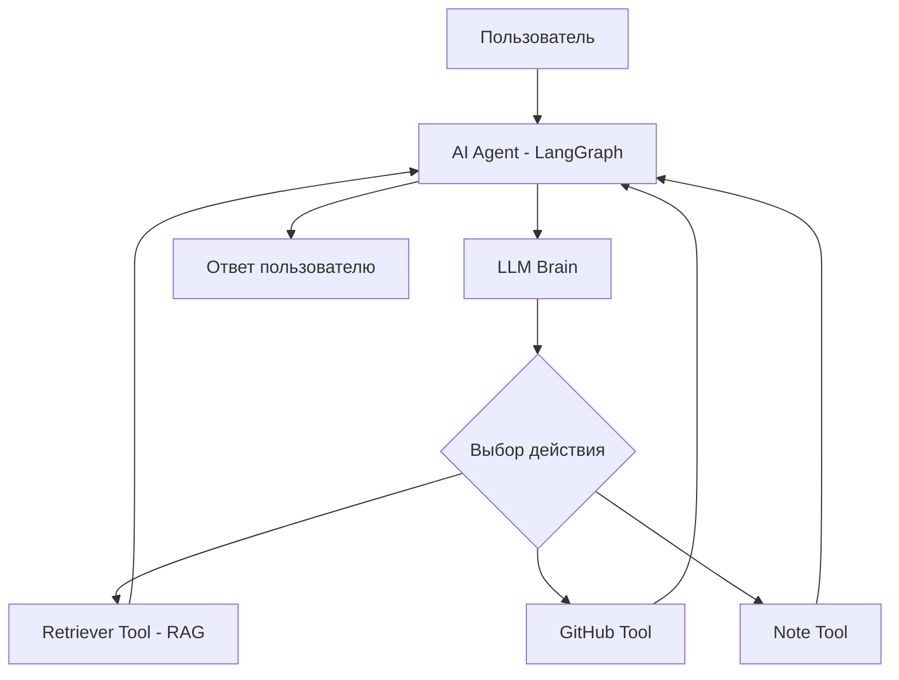

# AI Agent (LLM + Tools + RAG)

## 📝 Overview
An advanced AI agent that uses LLM for decision making, has access to external tools (search GitHub), and uses RAG for knowledge base management.

## 🏗 Architecture
The agent is implemented as a cyclic system (ReAct or Graph-based), where the LLM selects an action based on the context and available tools.

## 🛠 Technology Stack
- **AI/ML:** LangChain / LangGraph, OpenAI API
- **Vector DB:** Pinecone / ChromaDB / FAISS
- **Tools:** GitHub API, SerpApi (search)
- **Infrastructure:** Python

## 🧩 Component Breakdown
1. **Brain (LLM):** A logical core that plans steps.
2. **Knowledge Base (RAG):** A vector store with indexed data (e.g., GitHub issues).
3. **Toolbelt:** A set of tool functions that the agent can call.
4. **State Manager:** Manages the dialog state and action history (LangGraph State).

## 🔄 Data Flow
1. The user asks a complex question.
2. The agent analyzes the query and decides what information to retrieve.
3. The agent calls the Retriever Tool to search the local knowledge base.
4. If necessary, the agent calls the GitHub API to retrieve up-to-date data.
5. The agent synthesizes the final response.

## 🎓 Learning Objectives (Skills)
- Designing Agent Architecture (Phase 6)
- Implementing RAG Pipelines (Phase 5)
- Using LangGraph to Manage Logic (Phase 6)
- Working with Vector Databases (Phase 5).

## 🚀 Future Improvements
- Memory addition (Long-term memory).
- Autonomous task execution (Multi-step reasoning).
- Group operation of multiple agents (Multi-agent systems).
