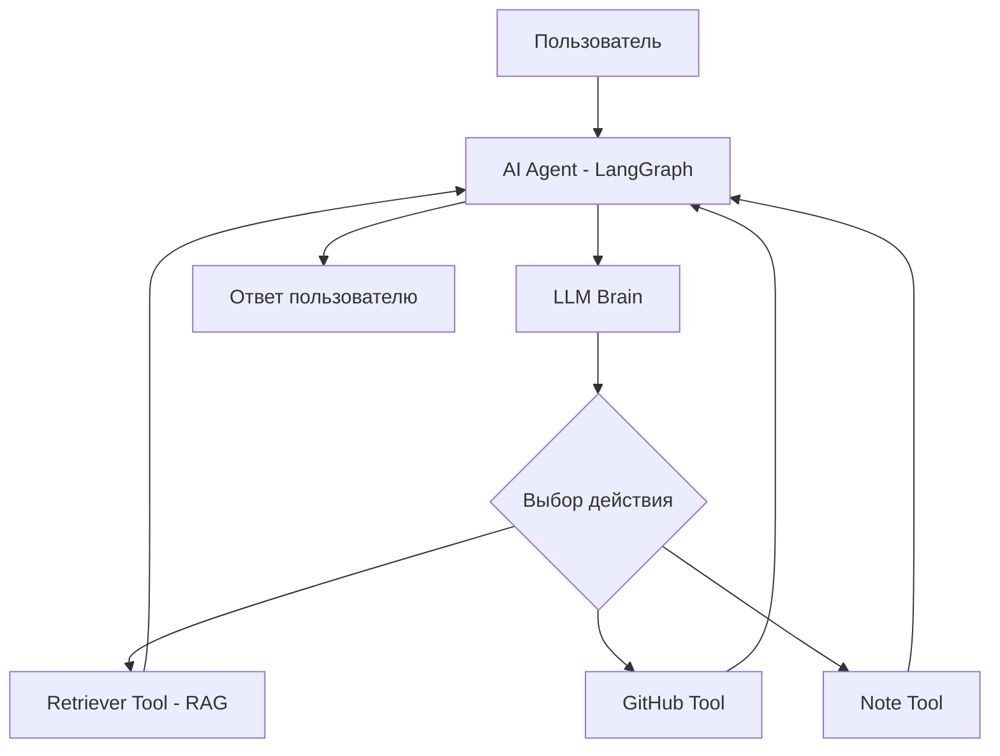

# AI Agent (LLM + Tools + RAG)

## 📝 Overview
Продвинутый AI-агент, который использует LLM для принятия решений, имеет доступ к внешним инструментам (поиск по GitHub) и использует RAG для работы с базой знаний.

## 🏗 Architecture
Агент реализован как циклическая система (ReAct или Graph-based), где LLM выбирает действие на основе контекста и доступных инструментов.

## 🛠 Technology Stack
- **AI/ML:** LangChain / LangGraph, OpenAI API
- **Vector DB:** Pinecone / ChromaDB / FAISS
- **Tools:** GitHub API, SerpApi (search)
- **Infrastructure:** Python

## 🧩 Component Breakdown
1. **Brain (LLM):** Логическое ядро, планирующее шаги.
2. **Knowledge Base (RAG):** Векторное хранилище с индексированными данными (например, GitHub issues).
3. **Toolbelt:** Набор функций-инструментов, которые агент может вызывать.
4. **State Manager:** Управление состоянием диалога и историей действий (LangGraph State).

## 🔄 Data Flow
1. Пользователь задает сложный вопрос.
2. Агент анализирует запрос и решает, какую информацию нужно найти.
3. Агент вызывает Retriever Tool для поиска по локальной базе знаний.
4. Если нужно, агент вызывает GitHub API для получения актуальных данных.
5. Агент синтезирует финальный ответ.

## 🎓 Learning Objectives (Skills)
- Проектирование архитектуры агентов (Phase 6)
- Реализация RAG пайплайнов (Phase 5)
- Использование LangGraph для управления логикой (Phase 6)
- Работа с векторными БД (Phase 5).

## 🚀 Future Improvements
- Добавление памяти (Long-term memory).
- Автономное выполнение задач (Multi-step reasoning).
- Групповая работа нескольких агентов (Multi-agent systems).
